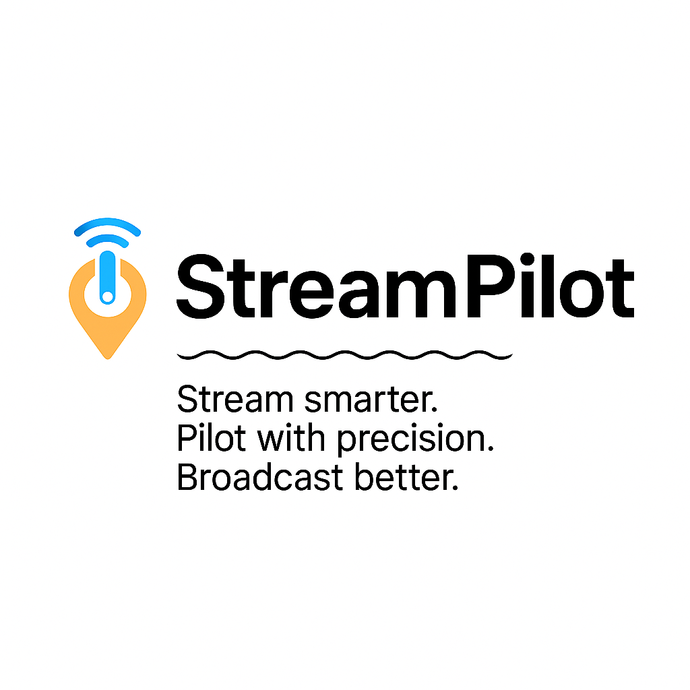
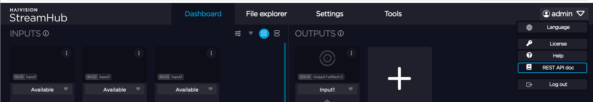
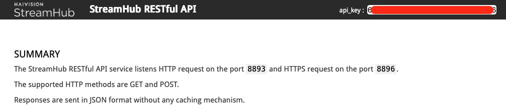
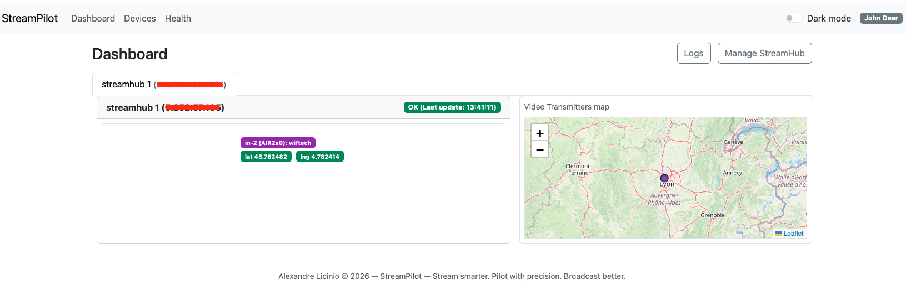
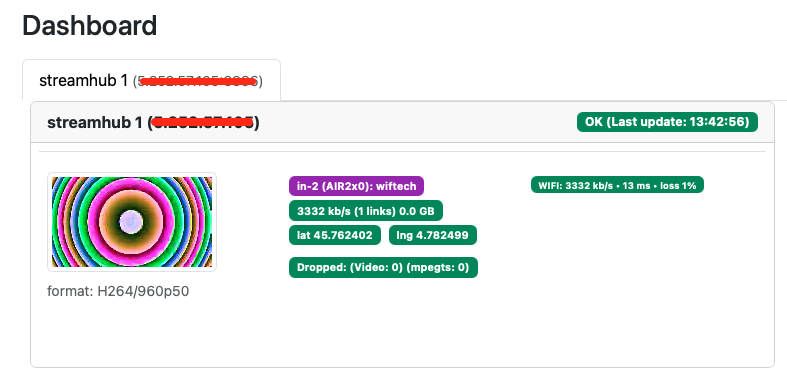
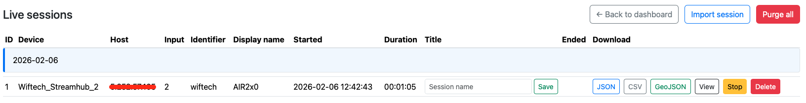
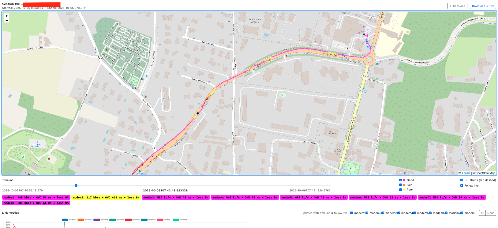
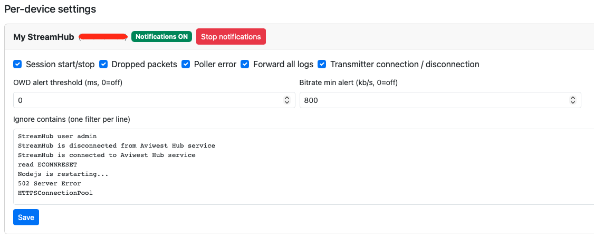
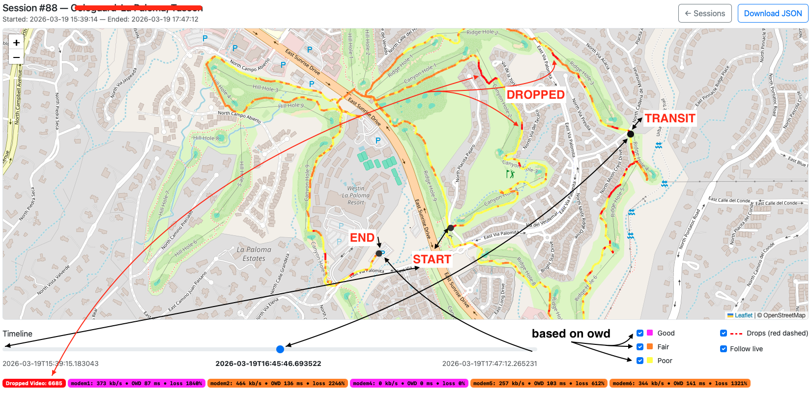
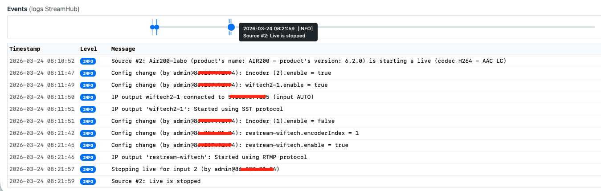

# StreamPilot - Stream smarter. Pilot with precision. Broadcast better.

<p align="center">
  
</p>

<p align="center">
  <a href="http://localhost:5555">
    
  </a>
</p>

**StreamPilot** est une application web de supervision et de visualisation géolocalisée en temps réel des transmetteurs **Haivision**. Les stats des modems 4G/5G, ETH1-2, WIFI et USB sont enregistrés et visibles en temps réels pendant chaque session live via plusieurs graphiques. Cet outil peut être utilisé en live ou en repérage afin de cartographier une zone de couverture précise en 4G/5G privée/publique ou n'importe quelle interface réseau (ETH1-2, STARLINK, WIFI, USB) supportée par le transmetteur. 
Idéal pour le broadcast en mobilité : Tour cycliste, marathons, triathlons, production distante et déploiement 5G privative.

Les données brutes sont fournies par le **Haivision Streamhub** qui collecte et distribue via une API REST (HTTP/HTTPS). Toutes les interfaces réseaux et le GPS sont monitorés.
Les séries AIRxxx et PROxxx sont celles disposant d'un capteur GPS.

De plus, il génère des rapports PDF détaillés à la fin d'un live. Ces rapports contiennent les logs StreamHub correspondants pour chaque transmetteurs, vous permettant ainsi de partager les informations pertinentes.

### Le futur de Streampilot ?

À ce jour, il n'est pas possible d'obtenir via l'API REST du StreamHub toutes les informations techniques de chaque modem (Bande, Nom de l'opérateur, SNR, RSSI et priorité). Mon but est que **StreamPilot** puisse piloter chaque modem afin de commuter en live le ou les meilleurs interfaces réseaux. Cela permettrait de garantir une qualité de transmission supérieure en rendant automatique la gestion de priorité des interfaces.

### Pourquoi StreamPilot?

J'avais besoin d'un outil pour les repérages et les live pour Wiftech, ma société. Je ne travaille pas pour Haivision, mais j'ai choisi Aviwest comme équipement principal pour la diffusion en live pour mes clients et différents services. J'encourage tous les fabricants de matériels de vidéo en direct à partager dans leur API toutes les données brutes nécessaires à l'amélioration de StreamPilot.

---

### Roadmap:

- [x] Haivision SST transmitters
- [x] Notifications slack
- [ ] Pilotage des priorités et des modems (besoin de plus de contrôle via l'API)

---

## Pré-requis:

Debian13
Python 3.13 au moins

## Installation:

Il n'est pas nécessaire d'être en **root**. Ni pour l'installation, ni pour le lancement de Streampilot.

1. Téléchargez le projet puis dans le dossier, créez un environnement virtuel Python :

```bash
git clone https://github.com/AlexandreLicinio/streampilot.git
cd streampilot
python3 -m venv --system-site-packages .
```

2. Installez les dépendances principales :

```bash
bin/python -m pip install CherryPy Mako requests reportlab
```
---

## Lancement du serveur:

Au premier lancement, tous les fichiers ainsi que la db seront automatiquement construits.
Définissez le port d’écoute (exemple : 5555) et démarrez le serveur depuis la racine du projet:

```bash
bin/python -m streampilot -port 5555 -name "John Dear" -max_streamhubs 4
```

> Variables d'environnements

- `-port` : Port TCP de l'UI (par défaut: 5555).
- `-name` : Nom générique dans l'UI.
- `-max_streamhubs` : Nombre maximum de Streamhub pollés par l'application (par défaut: 4)

L’application sera accessible sur [http://localhost:5555](http://localhost:5555).

---

## Utilisation:

<p align="center">
  
</p>

Dans le menu à droite du StreamHub, allez dans **REST API doc**.

<p align="center">
  
</p>

Copiez la clef **api_key**.

Dans Streampilot [http://localhost:5555](http://localhost:5555), allez dans le menu **Devices** et ajouter un StreamHub en remplissant les champs. Une fois ajouté, l'équipement est pollé tant que Streampilot est actif.

<p align="center">
  
</p>

Dès qu'un transmetteur est en ligne et que les données GPS sont accessibles via l'api, sa position est indiquée sur le carte du Dashboard. 

<p align="center">
  
</p>

Si le transmetteur passe en **live** une session est automatiquement créée. 

<p align="center">
  
</p>

Les sessions sont accessibles via le menu **Logs**. En cliquant sur le bouton **View** de la session en cours vous pouvez visualiser en temps-réel la position GPS et l'état des interfaces réseaux du transmetteur SST.


<p align="center">
  
</p>

Tant que le transmetteur est en **live**, les graphiques et la timeline vont progresser. En décochant **Follow live** vous pouvez bouger la timeline afin de visualiser un moment précis (GPS + INTERAFACES). 

### Slack notifications:

Suivez les instructions via ce lien [https://docs.slack.dev/messaging/sending-messages-using-incoming-webhooks/](https://docs.slack.dev/messaging/sending-messages-using-incoming-webhooks/), dans le menu **Settings** configurez les détails concernant le webhook puis pour chaque StreamHub les détails cocnernant chaque type de notifications.

Dans l'encadré **Ignore contains (one filter per line)** vous pouvez ajouter tout ou partie d'un log afin de le filtrer et de ne pas le recevoir. Cela est très pratique pour ne pas être alerté à propos d'une information non pertinente.

```bash
StreamHub user admin
StreamHub is disconnected from Aviwest Hub service
StreamHub is connected to Aviwest Hub service
read ECONNRESET
Nodejs is restarting...
502 Server Error
HTTPSConnectionPool
```

Vous pouvez définir un seuil afin d'être alerté en cas de dépassement d'une certaine valeur pour l'OWD et le bitrate total.

<p align="center">
  
</p>

---

## Sessions

### La carte (gps):

Lorsqu'un émetteur est actif, une nouvelle session est créée. Si le GPS reçoit des données par satellite, une carte affichera la position exacte de l'émetteur. En cochant la case **Follow live**, la timeline s'actualisera en temps réel et tous les graphiques afficheront les statistiques des interfaces. Sur la carte, une ligne colorée sera tracée entre les nouveaux points GPS. La couleur est basée sur le **OWD**, qui correspond à la moitié du RTT pour chaque interface.

| Signal        | OWD (in ms, rtt/2) |
| ------------- |:------------------:|
| Good          | less 100 ms        |
| Fair          | from 100 to 200 ms |
| Poor          | more than 200 ms   |

À la fin d'une session (ou même pendant le live), vous pouvez déplacer le curseur de la timeline pour consulter les données enregistrées. Une ligne verticale, correspondant à la position du curseur, apparaîtra sur chaque graphique. 

<p align="center">
  
</p>

### Events (logs StreamHub):

Tous les logs de StreamHub sont triés par transmetteur (input) et affichés sous forme de chronologie et de tableau. Ces journaux peuvent également être exportés aux formats PDF et JSON à la fin de la diffusion en direct.

<p align="center">
  
</p>

---

## Fonctionnalités:

- **Supervision** des transmetteurs Haivision StreamHub via le protocole SST. 
- **Géolocalisation en temps réel** des inputs SST sur une carte interactive.  
- **Timeline de session** avec métriques : bitrate, OWD, pertes, dropped packets.  
- **Export JSON/CSV** des sessions avec toutes les mesures (GPS, liens, drops…).  
- **Import JSON** des sessions avec toutes les mesures (GPS, liens, drops…).
- **Export GeoJSON** pour analyses externes (QGIS, Kepler.gl, geojson.io…).  
- **Export PDF** pour générer des rapports.
- **Sessions GPS** avec suppression individuelle ou purge totale.  
- **Vue Health (/health)** avec état du poller, sessions actives, âge des derniers samples par streamhub.  
- **Sparklines** (mini courbes SVG sur 1–2 minutes) de l’âge du dernier sample.  
- **Endpoint JSON (/health_json)** pour monitoring externe.  
- **Endpoint Prometheus (/metrics)** pour intégration Grafana/Prometheus.  
- **Follow live** pour voir l’actualisation en direct des sessions.  
- **Background poller** indépendant de l’UI, qui capture les sessions même si le Dashboard n’est pas ouvert.  
- **Thème clair/sombre** via toggle.  
- **Dashboard responsive** (Bootstrap 5).
- **Notifications slack** via webhook

---

## Haivision:

Le StreamHub est le collecteur de l'ensemble des données des transmetteurs Haivision. 
Voici les données actuellement présente via l'API qui sont utilisées par interface réseau.

| endpoint        | api                |
| ----------------|:------------------:|
| bitrate         | OK                 |
| gps             | OK                 |
| RTT             | OK                 |
| loss            | OK                 |
| lost packets    | OK                 |
| operateur mobile| NOK                |
| 4G/5G bande     | NOK                |
| 3G/4G/5G        | NOK                |
| snr             | NOK                |
| rssi            | NOK                |
| priorité        | NOK                |

**StreamPilot** supporte ces firmwares:

| modele        | firmware version   |
| ------------- |:------------------:|
| air series    | 6.2.0              |
| streamhub     | 4.4.6_SP1          |
| rack400       | 4.2.0              |
| rack2-3       | 6.2.0              |
| PRO3 series   | 6.2.0              |

---

## Monitoring et intégrations:

- **/health** : état du poller, sessions, âge des samples.
- **/health_json** : monitoring externe (JSON).
- **/metrics** : endpoint Prometheus pour Grafana/Prometheus.

---

## Branding:

- Produit : **StreamPilot**  
- Tagline : *Stream smarter. Pilot with precision. Broadcast better.*  
- Copyright : StreamPilot — Copyright (C) 2026 Alexandre Licinio
- Author : Alexandre Licinio

---

## Contribution:

Toute personne ou entreprise souhaitant contribuer est la bienvenue. Si vous décidez de vous impliquer, n'hésitez pas à me contacter.

---

## Licence:

StreamPilot — Copyright (C) 2026 Alexandre Licinio

This program is free software: you can redistribute it and/or modify it
under the terms of the GNU Lesser General Public License as published by
the Free Software Foundation; either version 2.1 of the License, or
(at your option) any later version.

This program is distributed in the hope that it will be useful,
but WITHOUT ANY WARRANTY; without even the implied warranty of
MERCHANTABILITY or FITNESS FOR A PARTICULAR PURPOSE. See the
GNU Lesser General Public License for more details.

You should have received a copy of the GNU Lesser General Public License
along with this program in the file COPYING.LESSER. If not, see:
https://www.gnu.org/licenses/
