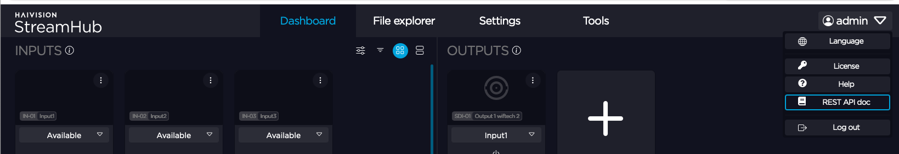
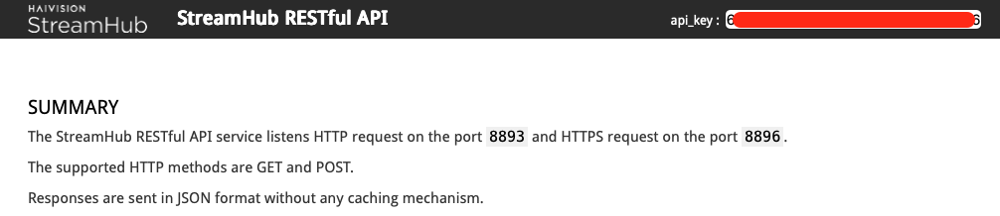
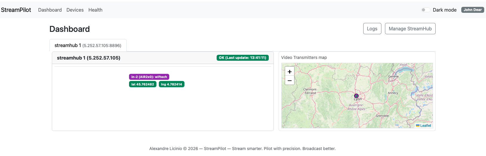
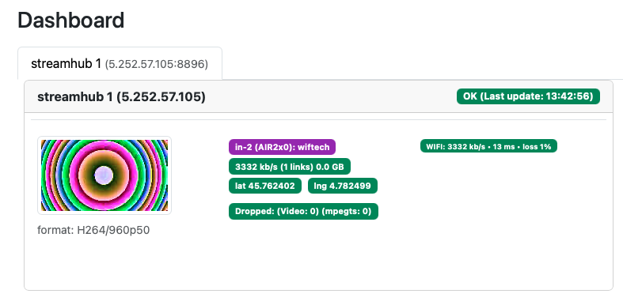
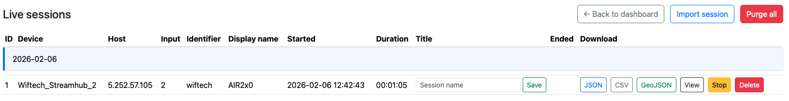
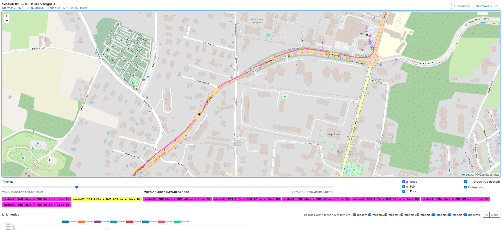

# StreamPilot — Stream smarter. Pilot with precision. Broadcast better.

<p align="center">
  
</p>

<p align="center">
  <a href="http://localhost:5555">
    
  </a>
</p>

**StreamPilot** is a web app for real‑time supervision and geo‑visualization (location) of **Haivision** transmitters. Stats from 4G/5G modems, ETH1‑2, Wi‑Fi and USB are recorded and displayed live during each session through several charts. You can use it during live production or site surveys to map precise coverage for public/private 4G/5G or any network interface (ETH1‑2, STARLINK, Wi‑Fi, USB) supported by the transmitter.
Ideal for mobile broadcast: cycle tours, marathons, triathlons, remote production, and private 5G deployments.

Raw data is provided by **Haivision StreamHub** via its REST API (HTTP/HTTPS). All network interfaces and GPS are monitored.
AIRxxx and PROxxx series are the ones with GPS sensors.

### What’s next for StreamPilot?

Today, StreamHub’s REST API doesn’t expose every modem details (Band, Operator name, SNR, RSSI, priority). The goal is for **StreamPilot** to actively **pilot each modem**, switching live to the best interface(s). This would raise transmission quality by automatically managing interface priorities.

---

### Roadmap

- [x] Haivision SST transmitters
- [ ] Slack notifications
- [ ] Modem and priority control (requires deeper API access from Haivision)

---

## Prerequisites

- Debian 13
- Python ≥ 3.13

## Installation

You **don’t** need to be **root** to install or run StreamPilot.

1. Download the project and create a Python virtual environment in the folder:

```bash
https://github.com/AlexandreLicinio/streampilot.git
cd streampilot
python3 -m venv --system-site-packages .
```

2. Install the main dependencies:

```bash
bin/python -m pip install CherryPy Mako requests
```

---

## Run the server

On the first run, all files and the database will be created automatically.
Set the listening port (example: 5555) and start the server from the project root:

```bash
bin/python -m streampilot -port 5555 -name "John Dear" -max_streamhubs 4
```
You can also specify port, name, max_streamhubs thru the following environment variables

> - `-port`: UI TCP port (default: 5555)
> - `-name`: Generic name displayed in the UI
> - `-max_streamhubs`: Maximum number of StreamHubs polled by the app (default: 4)

The app will be available at [http://localhost:5555](http://localhost:5555).

---

## Usage

<p align="center">
  
</p>

In the StreamHub side menu, go to **REST API doc**.

<p align="center">
  
</p>

Copy the **api_key**.

In StreamPilot [http://localhost:5555](http://localhost:5555), open **Devices** and add a StreamHub by filling in the fields. Once added, the device is polled as long as StreamPilot is running.

<p align="center">
  
</p>

As soon as a transmitter is online and GPS data is available via the API, its position appears on the Dashboard map.

<p align="center">
  
</p>

When the transmitter goes **live**, a session is created automatically.

<p align="center">
  
</p>

Sessions are accessible from the **Logs** menu. Click **View** on the running session to see real‑time GPS and network interfaces status for the SST transmitter.

<p align="center">
  
</p>

While the transmitter is **live**, charts and timeline progress continuously. If you uncheck **Follow live**, you can move the timeline to inspect a specific moment (GPS + INTERFACES).

---

## Features

- **Supervision** of Haivision StreamHub transmitters over the SST protocol
- **Real‑time geolocation** of SST inputs on an interactive map
- **Session timeline** with metrics: bitrate, OWD, losses, dropped packets
- **JSON/CSV export** of sessions with all measurements (GPS, links, drops…)
- **JSON import** of sessions with full measurements (GPS, links, drops…)
- **GeoJSON export** for external analysis (QGIS, Kepler.gl, geojson.io…)
- **GPS sessions** with individual deletion or full purge
- **Health view** (`/health`) with poller state, active sessions, last sample age per StreamHub
- **Sparklines** (mini SVG charts over 1–2 minutes) for last‑sample age
- **JSON endpoint** (`/health_json`) for external monitoring
- **Prometheus endpoint** (`/metrics`) for Grafana/Prometheus
- **Follow live** to keep the session view synced in real time
- **Background poller** independent from the UI (captures sessions even if the Dashboard isn’t open)
- **Light/Dark theme** toggle
- **Responsive dashboard** (Bootstrap 5)

---

## Monitoring & integrations

- **/health**: poller state, sessions, sample ages
- **/health_json**: external monitoring (JSON)
- **/metrics**: Prometheus endpoint for Grafana/Prometheus

---

## Branding

- Product: **StreamPilot**  
- Tagline: *Stream smarter. Pilot with precision. Broadcast better.*  
- Copyright: StreamPilot — Copyright (C) 2026 Alexandre Licinio  
- Author: Alexandre Licinio

---

## Contributing

Individuals and companies are welcome to contribute. If you’d like to get involved, feel free to reach out.

---

## License

StreamPilot — Copyright (C) 2026 Alexandre Licinio

This program is free software: you can redistribute it and/or modify it
under the terms of the GNU Lesser General Public License as published by
the Free Software Foundation; either version 2.1 of the License, or
(at your option) any later version.

This program is distributed in the hope that it will be useful,
but WITHOUT ANY WARRANTY; without even the implied warranty of
MERCHANTABILITY or FITNESS FOR A PARTICULAR PURPOSE. See the
GNU Lesser General Public License for more details.

You should have received a copy of the GNU Lesser General Public License
along with this program in the file COPYING.LESSER. If not, see:
https://www.gnu.org/licenses/
